# PolicyLens — Evidence-Grounded Legal & Policy RAG Workspace

PolicyLens is an advanced, production-grade Retrieval-Augmented Generation (RAG) system tailored for querying, researching, and extracting evidence-grounded insights from statutory legal acts, policy manuals, and complex regulatory documents. 

By default, the platform is pre-loaded with **8 official legislation acts of Pakistan**, and features an isolated **Try Your Own** workspace allowing users to upload custom PDFs to query them dynamically in real-time.

---

## 🚀 Key Features

* **Grounded Legal Intelligence**: Prevents hallucinations by using a strict grounding verification pipeline. The system indicates whether the source evidence is **Strong**, **Limited**, or **Insufficient** before generating responses.
* **Hybrid Search & Dynamic Embeddings**: Incorporates dense embedding models (`gemini-embedding-2`) clamped to 768 dimensions for FAISS index cross-compatibility.
* **Robust Self-Healing Fallback**: If Gemini API limits (e.g. `429 Too Many Requests` or `503 Service Unavailable`) are encountered, the backend automatically fails-safe to **local keyword-frequency matching** and **offline text extraction**, maintaining 100% uptime.
* **Verbatim Citation Drawer**: Every generated response includes precise bracketed citations (e.g. `[1]`, `[2]`). Clicking a citation opens a sliding drawer that displays the verbatim source passage, page number, and section metadata.
* **Curated Premium UI**: A fully responsive Single Page Application (SPA) designed with a clean purple theme, fluid micro-interactions, input glows, hover scaling, and an interactive **Document Library** rendering page counts dynamically using PyMuPDF (`fitz`).
* **Evaluation & Testing Suite**: Features an automated evaluation harness in `evaluation/evaluate.py` to compile precision (Hit@5), groundedness, relevance, and latency metrics across reference test cases.

---

## 🏗️ System Architecture

```mermaid
graph TD
    subgraph Ingestion Pipeline
        A[PDF Source Acts] --> B[PyMuPDF Text Extractor]
        B --> C[Structural Text Chunker]
        D[Gemini Embedder 768-Dim] --> E[(FAISS Vector Database)]
        C --> D
    end

    subgraph RAG Query Pipeline
        F[User Query Input] --> G{Embedding API OK?}
        G -- Yes --> H[Dense Vector Embeddings]
        G -- No / 429 --> I[Local Keyword Extraction]
        H --> J[FAISS Vector Search]
        I --> K[Local Chunk Frequency Match]
        J --> L[Context Assembly]
        K --> L
        L --> M{LLM API OK?}
        M -- Yes --> N[Gemini LLM Text Generator]
        M -- No / 429 --> O[Local Keyword Synthesizer]
        N --> P[Citation & Conflict Parser]
        O --> P
        P --> Q[Responsive UI Display]
    end
```



---

## 📂 Project Structure

```
PolicyLens/
├── app/
│   ├── core/                  # Core RAG Logic
│   │   ├── embeddings.py      # Embedding Models (Gemini, OpenAI, Local)
│   │   ├── llm.py             # LLM API Callers & Local offline fallbacks
│   │   ├── pdf.py             # PyMuPDF-based structural PDF parser
│   │   ├── rag.py             # Grounded RAG Query Pipeline
│   │   └── vector_store.py    # FAISS local vector store manager
│   ├── ui/                    # UI Routers & static directories
│   │   ├── static/            # Static assets
│   │   │   ├── css/style.css  # Purple theme styles and layout configs
│   │   │   ├── js/app.js      # SPA dashboard & navigation handlers
│   │   │   └── index.html     # Main Single Page Application interface
│   │   ├── chat.py            # Chat API endpoint
│   │   ├── dashboard.py       # Statistics API endpoint
│   │   └── documents.py       # PDF uploader, download, & metadata routers
│   └── __init__.py            # FastAPI Application routes & settings config
├── data/
│   ├── benchmark/             # Local pre-downloaded legal PDF documents
│   └── vector_stores/         # Local FAISS index files (.faiss & .pkl)
├── evaluation/                # Test suites & evaluation benchmarks
│   ├── evaluate.py            # Automated evaluation runner script
│   ├── questions.json         # Reference evaluation golden dataset
│   └── results.csv            # Evaluation statistics output
├── scripts/                   # Data utility scripts
│   ├── download_benchmark.py  # Benchmark PDF downloader tool
│   └── generate_benchmark_excerpts.py
├── .env                       # API Credentials (Excluded from git tracking)
├── .gitignore                 # Secure Git patterns
├── app.py                     # App execution entrypoint
└── config.py                  # Global configurations and variables
```

---

## 🛠️ Installation & Setup

### 1. Prerequisites
Ensure you have Python 3.8+ installed on your system.

### 2. Clone the Repository
```bash
git clone https://github.com/Hamzaiftikhar01/PolicyLens.git
cd PolicyLens
```

### 3. Install Dependencies
Install all required libraries using `pip`:
```bash
pip install fastapi uvicorn requests pymupdf faiss-cpu numpy pydantic python-dotenv
```

### 4. Configure Environment Variables
Create a file named `.env` in the project root directory and define your API keys:
```env
GEMINI_API_KEY=YOUR_GEMINI_API_KEY
OPENAI_API_KEY=YOUR_OPENAI_API_KEY
EMBEDDING_PROVIDER=gemini
LLM_PROVIDER=gemini
CHUNK_SIZE=1000
CHUNK_OVERLAP=200
```

---

## 🚦 How to Run the Application

### 1. Start the Server
Launch the FastAPI backend server using the main execution file:
```bash
python app.py
```
This will start the Uvicorn server locally at **[http://localhost:8000](http://localhost:8000)**.

### 2. Open the Single Page Application (SPA)
Open your web browser and navigate to:
👉 **[http://localhost:8000](http://localhost:8000)**

---

## 🧪 Running the Evaluation Harness
To execute the pre-configured legal benchmark queries and test the accuracy, latency, and groundedness of the RAG pipeline, run:
```bash
python evaluation/evaluate.py
```
The results and metrics analysis will be saved in `evaluation/results.csv` and `evaluation/report.md` automatically.
